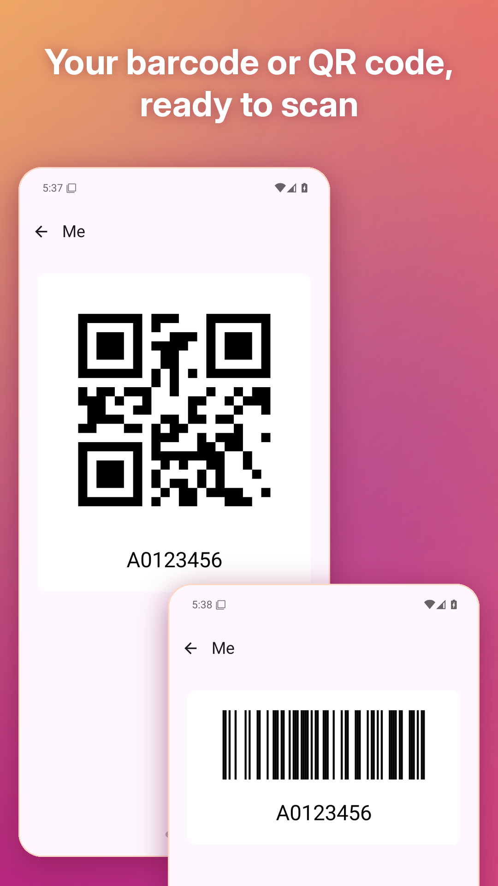
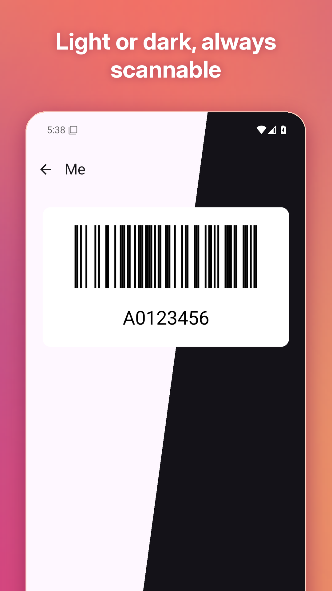
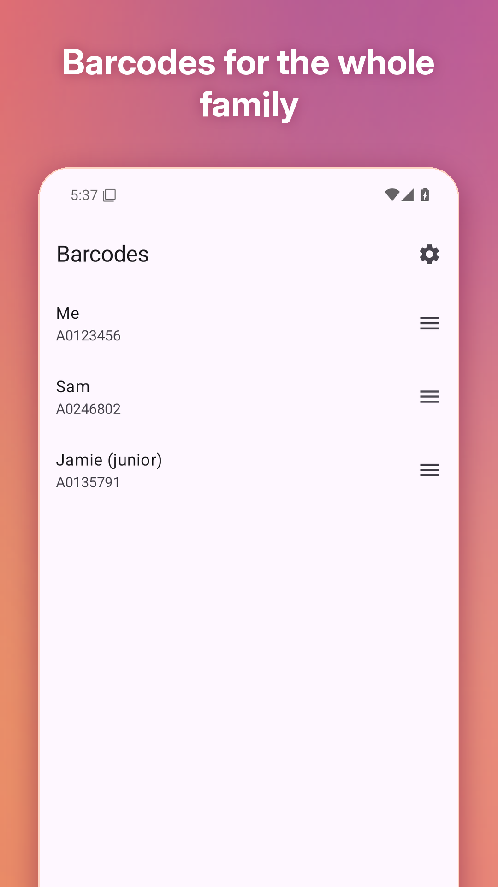
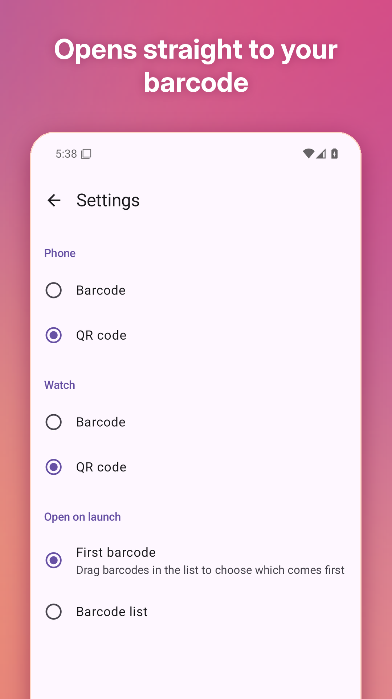
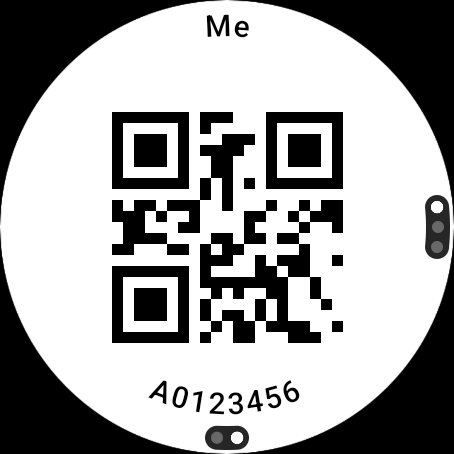
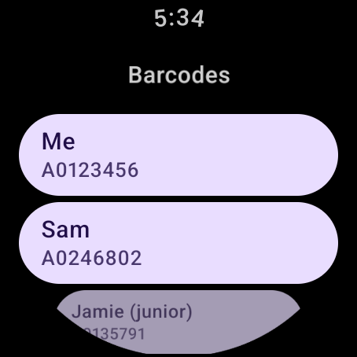
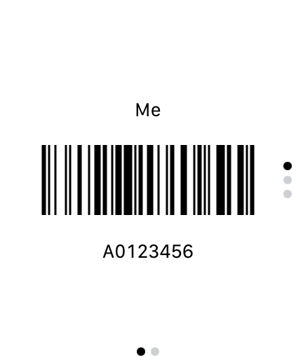
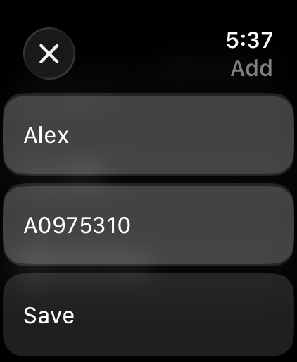

# Bibless

**Your parkrun barcode on your phone and watch. No printout needed.**

Forgot your printed barcode again? Bibless keeps your parkrun barcode on your phone and your watch – Android
and Wear OS, or iPhone and Apple Watch – so you can get scanned at the finish without carrying anything.

Bibless is an independent app and is not affiliated with or endorsed by parkrun.

<p align="center">
  
  
  
  
</p>
<p align="center">
  
  
  
  
</p>

## Features

- **Add your athlete ID once** (for example A1234567) and your barcode is ready to scan
- **Opens straight to your barcode** at full brightness, and keeps the screen on until you're scanned
- **Leave your phone at home on run day** – your barcodes are on your Wear OS watch or Apple Watch too
- **Barcodes for the whole family**: save as many as you like, put them in your order and swipe up for the next
  athlete – or turn the crown on your watch
- **QR code or classic barcode**: swipe sideways to switch, and pick the default separately for phone and watch
- **Add barcodes on your phone or directly on your watch** – they sync automatically
- **Get to it even faster**:

  | Android and Wear OS | iPhone and Apple Watch |
  |---|---|
  | Home screen widget | Home Screen widget |
  | Quick Settings tile that works on the lock screen | Lock Screen widget and Control Center |
  | App shortcuts for your first four barcodes | Siri, Shortcuts, Spotlight and the Action button |
  | Wear OS tile, one swipe from the watch face | Smart Stack on Saturday mornings |

- **No account, no ads, no tracking**: your data stays on your devices

The screenshots show demo data. They come from the store screenshot tests (see [Store screenshots](#store-screenshots))
and are copied here by hand, so they may lag behind the app a little.

## Project layout

Bibless is a Kotlin Multiplatform project.

| Module | What it is |
|---|---|
| [app/androidApp](./app/androidApp) | Android phone app (Compose, Material 3) with its widget, Quick Settings tile and shortcuts |
| [app/wearApp](./app/wearApp) | Wear OS app (Compose for Wear OS) and tile. It shares the phone app's `applicationId` |
| [app/iosApp](./app/iosApp) | Xcode project: the SwiftUI iPhone app, the [watchOS app](./app/iosApp/watchApp) embedded as its companion, and their widgets |
| [app/sharedLogic](./app/sharedLogic) | Logic shared by all apps (exported to Swift as the `SharedLogic` framework and to JS) |
| [app/sharedUI](./app/sharedUI) | Compose code the Android phone and watch apps share: barcode rendering, full brightness, opening the start barcode. No Material dependency |
| [core](./core) | Code shared by every target, including the server |
| [app/webApp](./app/webApp) | React web app on [GitHub Pages](https://nols1000.github.io/Bibless/). For now it hosts the privacy policies |
| [server](./server) | Ktor server, a placeholder for now |

Plans for organising timed community runs with Bibless are in [docs/community-runs.md](./docs/community-runs.md).
Releases and the store workflows are described in [docs/releasing.md](./docs/releasing.md).

## Building

You need JDK 21 and the Android SDK. The Apple apps also need Xcode, and the web app needs
[Node.js](https://nodejs.org/en/download). The run configurations in Android Studio or IntelliJ IDEA cover the
same tasks as these commands:

- **Android app**: `./gradlew :app:androidApp:assembleDebug`
- **Wear OS app**: `./gradlew :app:wearApp:assembleDebug`
- **iOS app**: open [app/iosApp](./app/iosApp) in Xcode and run the `iosApp` scheme. To build it from the command line
  as CI does:
  ```shell
  xcodebuild build -project app/iosApp/iosApp.xcodeproj -scheme iosApp -configuration Debug \
    -destination 'generic/platform=iOS Simulator' CODE_SIGNING_ALLOWED=NO
  ```
- **watchOS app**: open [app/iosApp](./app/iosApp) in Xcode and run the `watchApp` scheme
- **Web app**:
  ```shell
  npm run build:shared
  npm install
  npm run start
  ```
- **Server**: `./gradlew :server:run`

## Testing

### Unit tests and lint

These are the checks CI runs:

| Target | Command |
|---|---|
| Android and Wear OS | `./gradlew :app:sharedUI:testAndroidHostTest :app:sharedLogic:testAndroidHostTest` |
| Android lint | `./gradlew :app:androidApp:lintDebug :app:wearApp:lintDebug` |
| iOS and watchOS | `./gradlew :app:sharedLogic:iosSimulatorArm64Test :app:sharedLogic:watchosSimulatorArm64Test` |
| Web | `./gradlew :app:sharedLogic:jsTest` |
| Server | `./gradlew :server:test` |

### UI tests

The UI tests cover paging between barcodes, the widgets and tiles, the lock screen, links into the app and swiping
barcodes away. They run on an emulator, a simulator or a device:

- **Android**: `./gradlew :app:androidApp:connectedDebugAndroidTest` with a phone emulator running
- **Wear OS**: `./gradlew :app:wearApp:connectedDebugAndroidTest` with a Wear OS emulator running
- **iOS**: `xcodebuild test -project app/iosApp/iosApp.xcodeproj -scheme iosApp -destination 'platform=iOS Simulator,name=iPhone 17 Pro Max'`
- **watchOS**: `xcodebuild test -project app/iosApp/iosApp.xcodeproj -scheme watchApp -destination 'platform=watchOS Simulator,name=Apple Watch Ultra 3 (49mm)'`

### Store screenshots

The store screenshots are captured by the `ScreenshotTest`/`ScreenshotTests` UI tests with
[fastlane](https://fastlane.tools), using demo data. The headlines from
[fastlane/screenshots/captions.json](./fastlane/screenshots/captions.json) are drawn on with Pillow. You need Ruby
with Bundler and Python 3:

```shell
bundle install
pip install -r tools/screenshots/requirements.txt

# Running emulators, by their `adb devices` serials; leave out the ones you don't need
bundle exec fastlane android screenshots phone:emulator-5554 wear:emulator-5556
# iPhone and Apple Watch simulators
bundle exec fastlane ios screenshots
```

The Android screenshots go to `fastlane/metadata/android/en-US/images` and the Apple ones to `fastlane/screenshots/ios`.
Neither is committed. The [Screenshots workflow](./.github/workflows/screenshots.yml) captures them on CI as artifacts.
